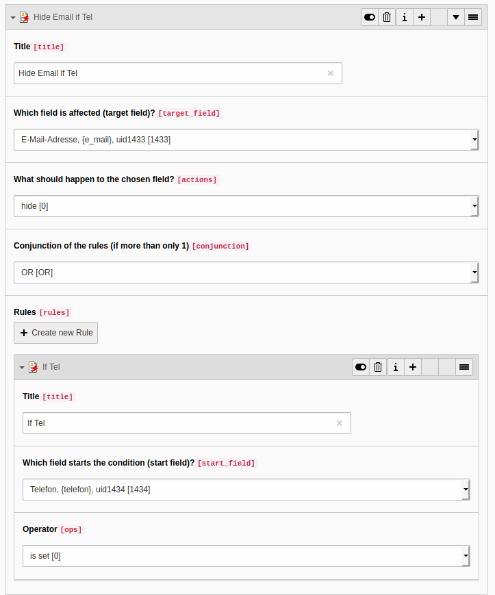

# TYPO3 Extension powermail_cond

Conditions for TYPO3 extension powermail.
While a user fills out a form, some fields should disappear, while
others should be visible.

## Screenshots





## Quick installation

Quick guide:
- Just install this extension - e.g. `composer require in2code/powermail_cond`
- Clear caches
- Add a powermail form to any page
- Add a new record from type "condition container" to a sysfolder and configure it
- Don't forget to include the static template from powermail_cond
- Don't forget to add jQuery to your frontend (if not yet installed)

Example routing configuration for TypeNum 3132:

```
...
rootPageId: 1
routes:
  -
    route: robots.txt
    type: staticText
    content: "Disallow: /typo3/\r\n"
routeEnhancers:
  PageTypeSuffix:
    type: PageType
    default: /
    index: ''
    suffix: /
    map:
      condition.json: 3132
...
```

## Early Access Programm (EAP)

You can support the development via our EAP on https://www.in2code.de/en/agency/typo3-extensions/early-access-program/
Also official (fee-based) support is possible within the EAP.

This is the current status of the EAP features:

| Version | TYPO3  | PHP              | Support/Development                   | Status    |
|---------|--------|------------------|---------------------------------------|-----------|
| 10      | 11 LTS | 7.4, 8.0, 8.1    | Support for TYPO3 11 and Powermail 10 | available |
| 11      | 12 LTS | 8.0, 0.1         | Support for TYPO3 12 and Powermail 11 | planned   |

## Changelog

| Version | Date       | State   | Description                                                                                          |
|---------|------------|---------|------------------------------------------------------------------------------------------------------|
| 10.1.0  | 2023-03-14 | Task    | Support all kind of powermail fields as with jQuery before (e.g. submit, text, etc...)               |
| 10.0.0  | 2022-10-10 | Feature | Support for Powermail 10 and remove of jQuery support                                                |
| 9.0.4   | 2022-10-10 | Bugfix  | Allow multilanguage conditions                                                                       |
| 9.0.3   | 2022-07-05 | Bugfix  | Fix ext_emconf.php for TER upload via REST API (another change)                                      |
| 9.0.2   | 2022-07-05 | Bugfix  | Fix ext_emconf.php for TER upload via REST API                                                       |
| 9.0.1   | 2022-07-04 | Bugfix  | Fix page fieldset conditions not being applied correctly                                             |
| 9.0.0   | 2022-02-23 | Feature | Support for TYPO3 11 and Powermail 9                                                                 |
| 8.2.2   | 2021-11-22 | Bugfix  | Reverted type change for field condition.target_field and updated index configuration for this field |
| 8.2.1   | 2021-11-22 | Bugfix  | Use integer field for condition.target_field                                                         |
| 8.2.0   | 2021-11-22 | Task    | Add mysql indices, hide children tables in list view, add code linting tests                         |
| 8.1.1   | 2021-08-04 | Task    | Simplify TCA to also fix the start/endtime bug in TYPO3 (last regression)                            |
| 8.1.0   | 2021-03-18 | Feature | Add TER autodeployment, add extension key to composer.json, small doc fix                            |
| 8.0.3   | 2020-04-30 | Bugfix  | Enforce content-type in TypoScript                                                                   |
| 8.0.2   | 2020-04-30 | Bugfix  | Also support checkboxes (array values) in powermail 8                                                |
| 8.0.1   | 2020-04-29 | Task    | Add useless dependency to TYPO3 for TER upload                                                       |
| 8.0.0   | 2020-04-29 | Task    | Update extension for powermail 8 and TYPO3 10.4                                                      |
| 7.0.0   | 2018-11-16 | Task    | Update dependencies for powermail 7                                                                  |
| 6.1.0   | 2018-10-21 | Task    | Remove deprecation warnings in TYPO3 9.5                                                             |
| 6.0.0   | 2018-10-16 | Task    | Support powermail 6.1                                                                                |
| 5.0.0   | 2018-05-24 | Task    | Support powermail 6.0                                                                                |
| 4.1.1   | 2018-03-28 | Bugfix  | Prevent exceptions in log                                                                            |
| 4.1.0   | 2018-01-29 | Task    | Remove dependencies for TYPO3 7.6                                                                    |
| 4.0.0   | 2018-01-15 | Task    | Update dependencies for powermail 5.0                                                                |
| 3.5.2   | 2017-12-05 | Bugfix  | Turn of ConditionAwareValitor on fields without page relations                                       |
| 3.5.1   | 2017-12-13 | Bugfix  | Prevent exceptions in backend for MySQL strict mode                                                  |
| 3.5.0   | 2017-11-13 | Task    | Update dependencies for powermail 4.x                                                                |
| 3.4.0   | 2017-08-14 | Feature | Allow all fieldtypes for target, add JS compression                                                  |
| 3.3.4   | 2017-07-25 | Bugfix  | Reduce unneeded calls in frontend                                                                    |
| 3.3.3   | 2017-06-12 | Bugfix  | Small change for MySQL strict mode                                                                   |
| 3.3.2   | 2017-05-20 | Bugfix  | TCA update for TYPO3 8.7                                                                             |
| 3.3.1   | 2017-04-25 | Bugfix  | Fix package name in composer.json                                                                    |
| 3.3.0   | 2017-04-23 | Task    | Move ext to github, make it fit for TYPO3 8.7 LTS                                                    |

## More to come soon?

- Use vanilla JS instead of jQuery

## Conflicts

- It's not possible to use powermail multistep forms with powermail_cond
